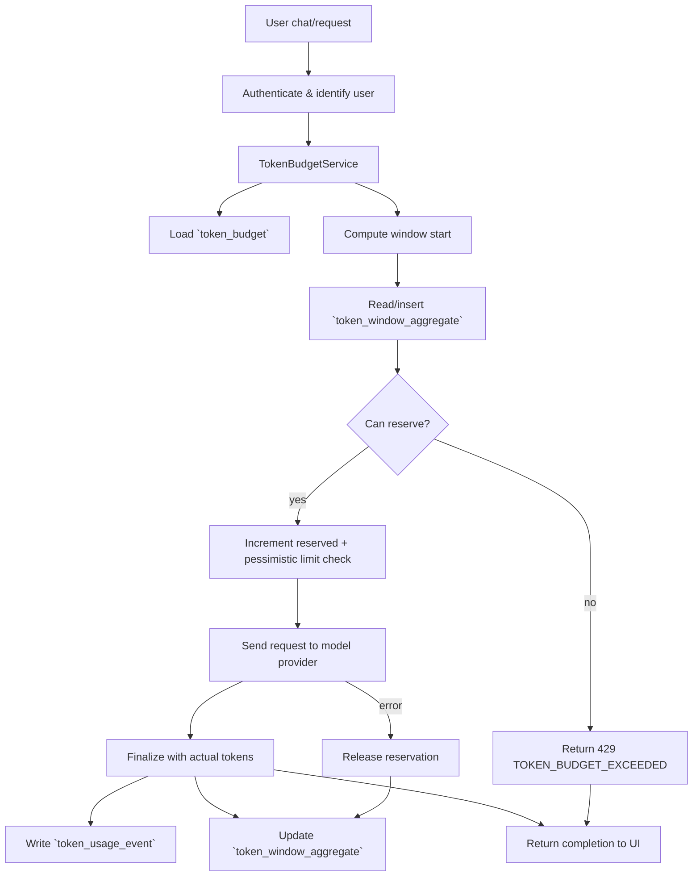

# How Token Limit Works

This note explains how the monthly token limit enforcement behaves inside Open WebUI, including the databases, services, and error surface. It is meant to sit alongside the existing planning docs in explore-architecture/ so teammates can quickly grasp the runtime flow.

## Architectural flow
1. **User submits a chat completion** via the WebUI or its proxies. The request carries the user ID, target provider, and any `max_tokens` hints.
2. **`TokenBudgetService` loads the user budget** (from `token_budget`) and computes the current monthly window. It tries to reserve tokens in `token_window_aggregate` before hitting the provider.
3. **The reserve step enforces the limit.** If `used + reserved + estimate > limit`, the service immediately returns HTTP `429 TOKEN_BUDGET_EXCEEDED`. Otherwise, it writes (or updates) the aggregate row with the new reservation.
4. **The provider call executes.** Once the model responds, the service finalizes the reservation, writes a `token_usage_event` with actual prompt/completion/total tokens, and adjusts the aggregate usage/reserved counters.
5. **Failures release reservations.** If the provider fails, the reservation rolls back so the tokens remain available for later requests.

## Tables in play
- `token_budget` stores each user's monthly limit, enabled flag, and timezone metadata.
- `token_window_aggregate` keeps per-window usage and reservation totals for fast, concurrency-safe enforcement.
- `token_usage_event` is the audit log used for analytics, tables, and the admin UI.

## Mermaid workflow

This diagram highlights the decision points for reservation and finalization, ensuring the limit is checked before the provider call and only updated after the provider finishes.
